# Släktforskning — User Manual

The long-form reference for Släktforskning ("genealogy" in Swedish). For a 10-minute walk-through that takes you from empty to your first sourced family, see the [README quickstart](README.md#your-first-family-tree-in-10-minutes). This manual is the deeper reference — every panel, every modal, every importer, every report.

Image credits for the demo family used in screenshots are in [docs/manual/image-credits.md](docs/manual/image-credits.md).

## Table of contents

1. [Installing and first launch](#installing-and-first-launch)
2. [Persons](#persons)
3. [Events](#events)
4. [Places](#places)
5. [Sources and Citations](#sources-and-citations)
6. [Repositories](#repositories)
7. [Media and Face Tags](#media-and-face-tags)
8. [Groups](#groups)
9. [Research Tasks](#research-tasks)
10. [Reports](#reports)
11. [Family tree charts (Prints)](#family-tree-charts-prints)
12. [Map view](#map-view)
13. [Importing GEDCOM](#importing-gedcom)
14. [Importing from Genney](#importing-from-genney)
15. [Importing from Holger](#importing-from-holger)
16. [Importing from RootsMagic](#importing-from-rootsmagic)
17. [Importing from Gramps](#importing-from-gramps)
18. [Exporting](#exporting)
19. [Website export](#website-export)
20. [Settings](#settings)
21. [Keyboard shortcuts](#keyboard-shortcuts)
22. [Accessibility](#accessibility)
23. [Data ownership and backup](#data-ownership-and-backup)
24. [Troubleshooting and FAQ](#troubleshooting-and-faq)

---

## Installing and first launch

| Platform | Installer | Notes |
|---|---|---|
| macOS | `.dmg` — drag the bundled `.app` into `/Applications` | Unsigned; right-click → Open the first time to bypass Gatekeeper |
| Windows | `.exe` (NSIS) | Unsigned; SmartScreen warns the first time — click "More info" → "Run anyway" |
| Linux | `.AppImage` — `chmod +x` and double-click, or run from a terminal | Single-file portable bundle |

On first launch the app opens to an empty Persons view. The database lives in either:

- **Portable mode**: `family.db` alongside the executable (if its directory is writable — useful for USB-stick installs).
- **Installed mode**: the platform's app data dir (`~/Library/Application Support/io.github.jonaseck2.slaktforskning/family.db` on macOS; `%APPDATA%/io.github.jonaseck2.slaktforskning/` on Windows; `~/.local/share/io.github.jonaseck2.slaktforskning/` on Linux).

The app remembers the last database you switched to, so reopening picks up where you left off. Use Settings → Database to switch to a different `.db` file at any time.

## Persons

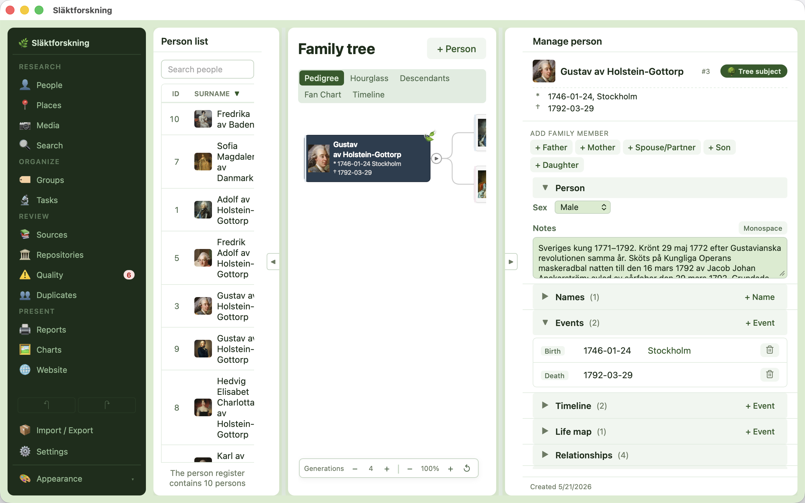

The Persons view is the heart of the app. The left list shows every person in the active database; the center pane shows either the list or a family-tree chart; the right side panel shows everything about the selected person.

The side panel is split into sections — every section is collapsible, every section's collapsed/expanded state is per-database. The full set:

- **Add family member** — quick buttons to add a father, mother, spouse, son, or daughter linked to the selected person.
- **Person** — sex, living status (derived from death events), free-text notes.
- **Names** — primary name plus alt/married/AKA names with their own date ranges and translations.
- **Identifiers** — external references (FamilySearch FT IDs, Ancestry tree IDs, Riksarkivet IDs, personnummer, refn/rin for GEDCOM round-trip).
- **Events** — every birth/death/marriage/etc., with date, place, citation count, and a per-event "Cite" affordance.
- **Timeline** — events sorted chronologically.
- **Life map** — places associated with this person plotted on a small map.
- **Relationships** — parents, spouses, children, siblings, godparents, associations (godparent/friend/colleague/enemy/neighbor/other).
- **Media** — photos, documents, and other files attached to this person; star ⭐ marks the current profile picture.
- **Media Timeline** — same media sorted by date.
- **Citations** — source citations grouped per claim about this person.
- **Notes** — shared notes (GEDCOM 7.0 SNOTE) attachable to multiple entities.
- **Groups** — collections this person belongs to.
- **Tasks** — open research tasks for this person.
- **Quality** — automated data quality flags (missing dates, orphan parents, contradictory facts).
- **Danger zone** — delete the person (cascades to events they're the primary participant of; preserves shared events).

Adding a person: click **+ Person** in the header. The Person modal captures the minimum (given name, surname, sex). Every other field is editable from the side panel later.

## Events

Events model genealogical facts — birth, death, marriage, occupation, etc. Every event has:

- An **event type** — one of ~30 supported types (birth, death, marriage, divorce, baptism, burial, census, immigration, naturalization, occupation, residence, education, military, religion, fact, other, and more).
- A **date** — exact (1746-01-24), approximate (about 1820), before/after (before 1750), between (1820 between 1825), calculated (from age), or unknown.
- An optional **place** — auto-resolved against the 29 bundled gazetteers.
- An optional **value** (occupation title, residence address, religion name, etc.).
- An optional **cause** — limited to death events.
- One or more **participants** — primary, spouse, parent, child, witness, godparent, officiant, other.
- Any number of **citations** linking this event to sources.
- A **negation flag** (GEDCOM 7.0 NO) — "X never happened" for X like military service or marriage.

Events live in the database independently of the persons that participate in them. A wedding is one event with two `primary` participants; a baptism is one event with the child as `primary`, the parents as `parent`, and any godparents as `godparent`. This lets the app correctly model multi-person events without duplicating data.

Add an event: from any person's side panel, expand the **Events** section and click **+ Event**.

## Places

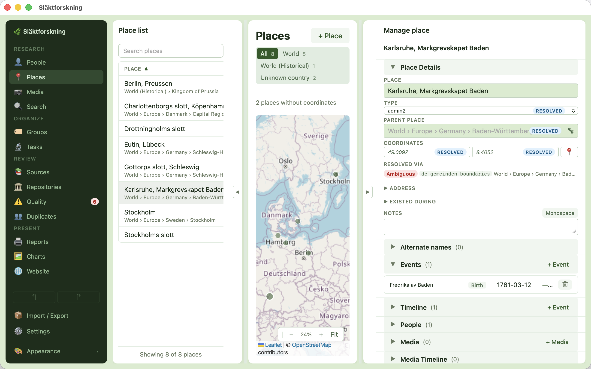

Places are organized hierarchically — a parish is a child of a county, which is a child of a country. The Places view (left sidebar → 📍 Places) shows your places either as a list or on a map.

- The **map** view plots every place with resolved coordinates as a pin. Pins cluster at low zoom.
- The **list** view sorts by name; filter chips on top let you slice by country.

Click a place row (or pin) to open the Place panel on the right:

- Resolved coordinates + which gazetteer matched (e.g. `dk-sogne-dawa / København`).
- Parent place hierarchy.
- Place translations (GEDCOM 7.0 TRAN) — same place name in alternate scripts/languages.
- Every event at this place (sorted chronologically).
- Every person born / died / married here.
- Linked media (e.g. a photo of the church building).
- Notes, groups, research tasks (same shape as for persons).

The 29 bundled gazetteers cover Sweden (parishes via SCB), Denmark (sogne via DAWA), Norway (kommune), Finland (kunta), Estonia, the United States (admin1–admin3), Canada (provinces), the United Kingdom (admin1–admin3), Germany (Länder + Kreise), and the world (countries + admin1). Place names auto-resolve as you type — Swedish exonyms (`Köpenhamn`) work too. Add custom gazetteers via Settings → Gazetteers (drag a built JSON file in).

## Sources and Citations

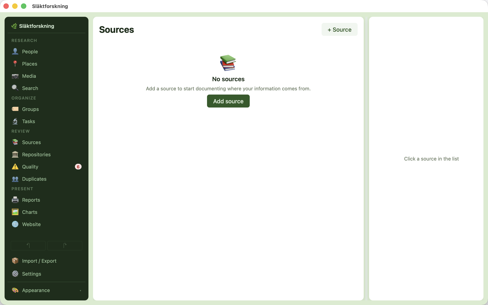

Sources are documents you cite — a birth certificate, a church record, an online tree, a published book. Citations link a specific source to a specific claim (an event, a person, a relationship, a name).

The Sources view shows every source in your database. Click a source to open the Source panel:

- Title, author, publication info, URL, source type, call number, abstract.
- **Source coverage events** — a source can declare it covers e.g. "BIRT events between 1850 and 1920 in Östergötland" (GEDCOM 7.0 SOUR/DATA/EVEN).
- **Citations from this source** — every citation that references this source, grouped by the person/event being cited.
- **Linked repositories** — archives where the original document is held.

Citing: from any event in a person's side panel, click **Cite**. The modal lets you pick or create a source, then captures the page reference, date accessed, confidence level (0–3: unreliable / questionable / secondary / primary), transcription, and notes.

**Source link rules** (Settings → Link Rules) auto-link URLs in your source text to ArkivDigital, Riksarkivet (Sweden), FamilySearch, Ancestry, MyHeritage, Findmypast, and others. Per-locale rule sets ship for Swedish, English, German, Danish, and Norwegian sources.

## Repositories

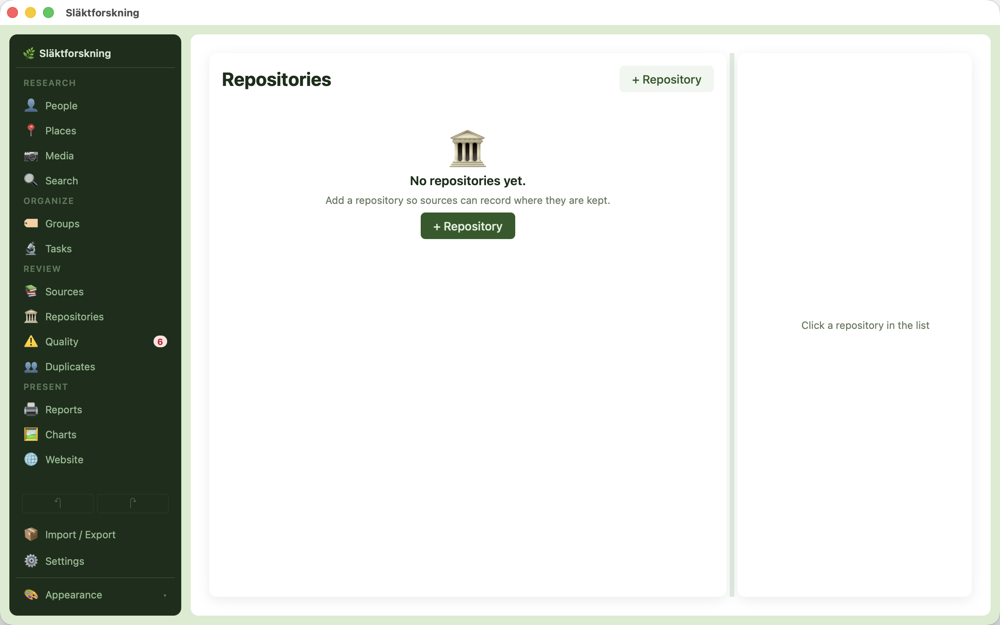

Repositories are archives — physical or online — that hold sources. Riksarkivet, the LDS Family History Library, your local parish archive, ancestry.com. The Repositories view has its own panel with the standard fields (name, address, city, postal code, state, country, phone, email, web, call number, notes) plus the list of sources held by this repository.

Repositories are decoupled from sources via the `source_repositories` join table — a single repository (say Riksarkivet) can hold thousands of sources, and a single source can be held by multiple repositories (a microfilm + the original).

## Media and Face Tags

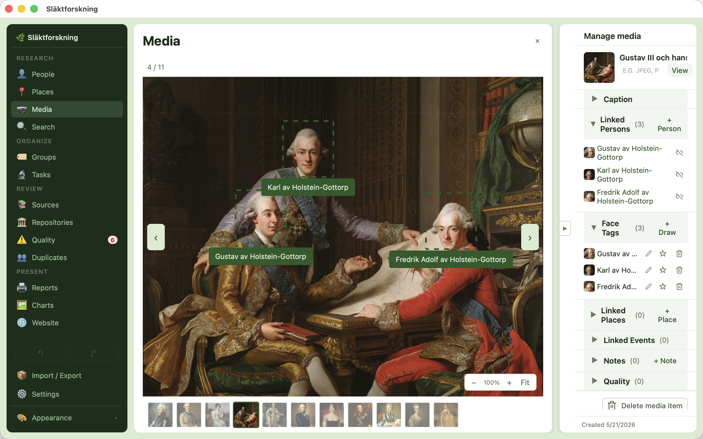

The Media view shows every photo, document, audio, or video attached to your database. Each media item:

- Has a title, format, free-text notes, and an "is printable" flag (used by photo album reports).
- Can be **linked** to any number of persons, events, places, or sources.
- Can carry **face-tag regions** — rectangular areas of an image linked to a person. The cropped face becomes that person's profile picture everywhere in the app.

The MediaPanel (right side) shows:

- A thumbnail of the file.
- **Linked Persons** — everyone connected to this media.
- **Face Tags** — every face-tag region with the person's name, avatar, and a ⭐ "set as profile" toggle. ☆ means "not the profile pic"; ★ means "this region IS the profile pic".

**To add a face tag**: double-click the media to open the viewer. Click **+ Draw**. Drag a rectangle around a face. A picker opens — choose the person. Save. The cropped face appears as that person's avatar in lists, charts, and panels.

**To move a tag**: in the viewer, click and drag the box to a new position. The avatar re-crops automatically.

**To set a different tag as the profile picture**: in the MediaPanel face-tag row, click the ☆ next to the desired region. The ⭐ moves; the avatar re-crops.

## Groups

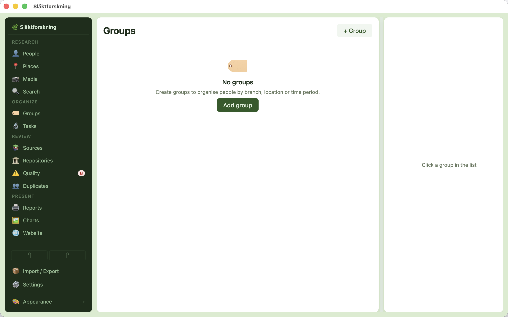

Groups organize persons (and places and media) into custom collections — "Emigrants 1845", "Military service", "Photos from grandma's box". The Groups view lists every group; the Group panel shows its members plus quick-add affordances for linking new members.

A person can be in many groups simultaneously. Groups are GEDCOM 7.0-modeled via SNOTE on the person; they round-trip cleanly through GEDCOM 7.0 export/import, and degrade to plain notes in GEDCOM 5.5.1.

## Research Tasks

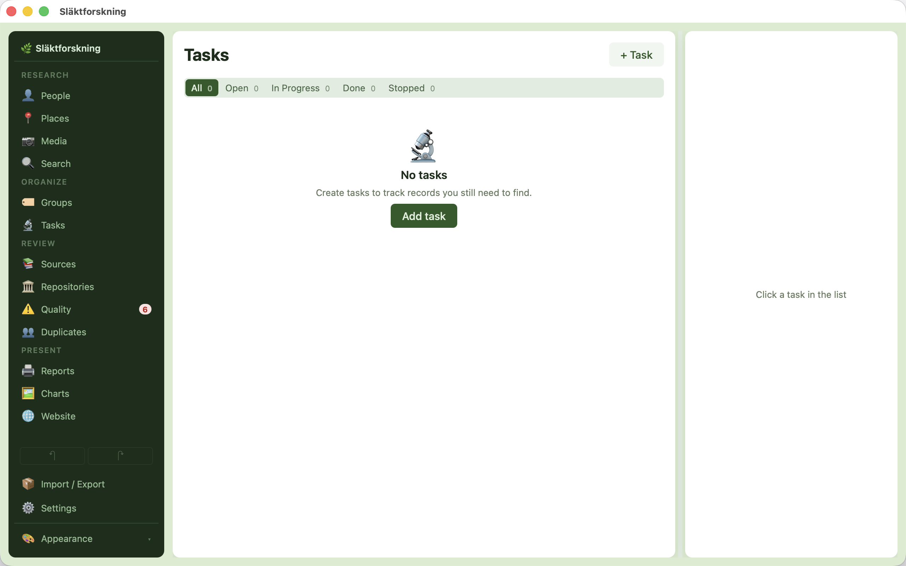

Research tasks are your to-do list. Each task has:

- **Priority** — high, normal, low.
- **Status** — open, in progress, done, stopped.
- **Task description** + notes + **result** (what you found when you closed it).
- **Linked entities** — persons, places, and media this task relates to.

The Research Tasks view shows every task; filter chips slice by status. The task panel mirrors the person/place/source pattern — a task is a first-class entity. Tasks degrade to NOTE blocks in GEDCOM export (no native task representation in either spec).

## Reports

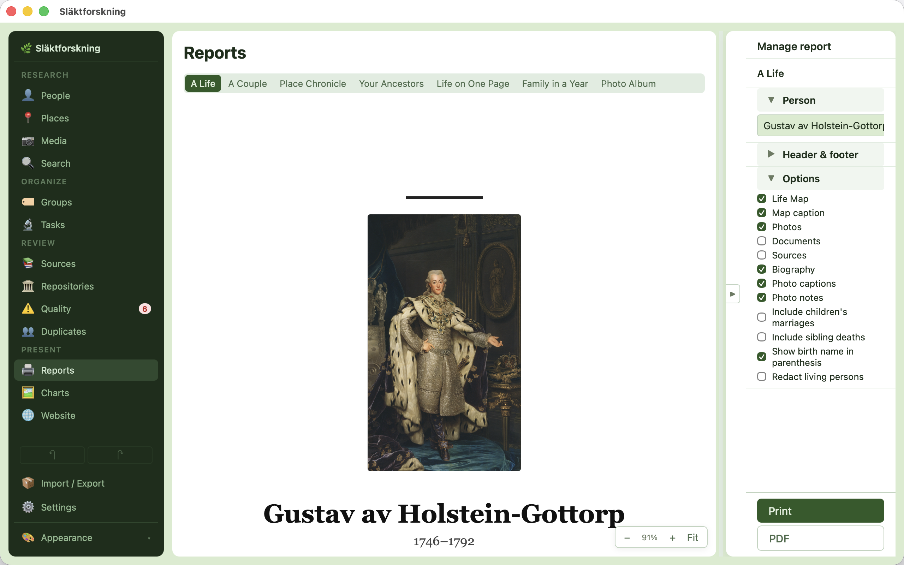

The Reports view (Present → 📑 Reports) is where you print or save shareable artifacts about your tree. Seven keepsake reports ship by default:

- **A Life** — one-page narrative biography of a single person with key events.
- **A Marriage** — one-page narrative of a couple's joint events.
- **Place Chronicle** — every event at a place, sorted chronologically.
- **Your Ancestors** — pedigree-style ancestor list.
- **Life on One Page** — visual timeline of a single life.
- **Family in Year X** — snapshot of every living relative on a given date.
- **Photo Album** — printable grid of every photo with people, dates, and places.

Each report has a configuration panel (which person, which date range, which sections to include). Save to PDF, save to SVG, or print directly. The print CSS is tuned for A4 and US Letter.

## Family tree charts (Prints)

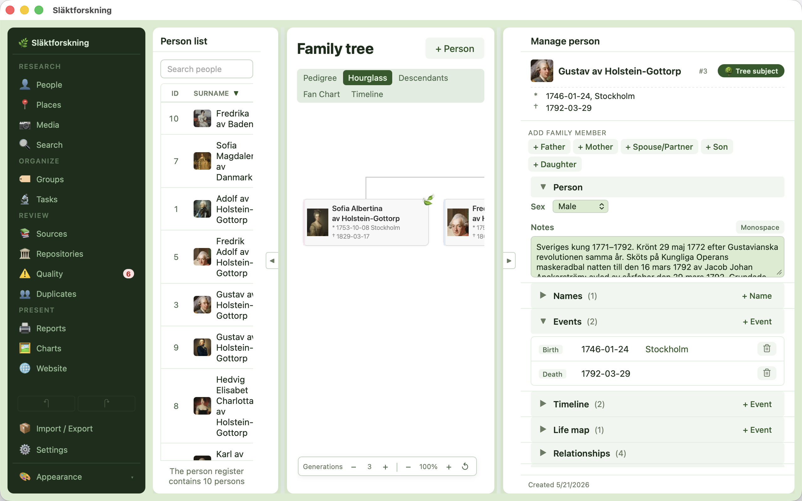

Family-tree charts live under Present → 📐 Prints (also reachable from any person's center pane via the **Family tree** tab). Five chart types:

- **Pedigree** — horizontal ancestors chart, focal person on the left.
- **Hourglass** — vertical, ancestors above the focal person, descendants below.
- **Descendants** — top-down descendants chart.
- **Fan chart** — radial pedigree; configurable arc span (180° / 210° / 240° / 270° / 360°), generation count (3–10), and color scheme.
- **Timeline** — horizontal time-axis chart showing every life as a bar.

Outline placeholders (dashed boxes with `+`) appear next to the selected person showing where a missing parent / spouse / child can be added — click an outline to open the Add Person modal pre-wired to the relationship.

Charts auto-render person portraits when face tags or linked media exist. Export to PDF or SVG via the panel; print directly via Cmd+P.

## Map view

The Map view (left sidebar → 📍 Places, then **Map** tab) plots every place with resolved coordinates. Pins cluster automatically. Click a pin to open the Place panel.

The map supports filtering by country (via the FilterChips above the map) and by has-coordinates / has-events / has-persons (derived dimensions, computed at render time per the Prime Directive).

## Importing GEDCOM

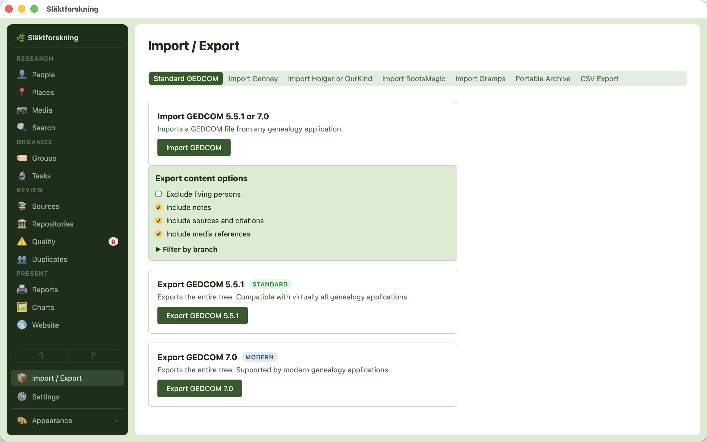

GEDCOM 5.5.1 and 7.0 are the genealogy interchange formats. The importer accepts both. Drop a `.ged` file via Settings → Import → GEDCOM.

The importer follows the Prime Directive — every authored field that the GEDCOM spec carries survives the round-trip. Anything that doesn't survive is **reported**, not silently dropped:

- ASSO without event (godparent / friend / etc., GEDCOM 7.0) — modelled as `person_associations`.
- NO X negative assertions (GEDCOM 7.0).
- TRAN translations for names and places (GEDCOM 7.0 §LANG).
- SOUR/DATA/EVEN coverage events.
- Shared notes (SNOTE).
- Sex X (intersex; GEDCOM 7.0).
- HEAD metadata preserved for export round-trip.

The import report shows: persons added, relationships added, events added, citations added, sources added, repositories added, media added, **plus** `warnings` (what survived but with caveats) and `unmappedData` (what couldn't be modelled — usually LDS ordinances in 5.5.1 files, which Släktforskning doesn't carry).

## Importing from Genney

Genney is a Swedish genealogy app. Its file formats are `.gcc` (current) and `.backup` (legacy). Both are imported natively without an external Genney install:

- `.gcc` files: extracted and the encrypted Derby DB is decoded via a bundled Bun sidecar. If decryption fails (rare — usually a password-protected `.gcc`), the importer falls back to the GEDCOM export inside the archive.
- `.backup` files: a JSON-based dump; parsed directly.

Genney's `SOURCE.NOTE` blocks become shared notes (GEDCOM 7.0 SNOTE-shaped) on import. Media files alongside the archive are copied into the per-database media folder.

## Importing from Holger

Holger is a Swedish desktop genealogy app. Its file format is `.zip+media` — a ZIP archive with a GEDCOM-shaped inner file plus a media subfolder. Drop the ZIP via Settings → Import → Holger; the importer extracts the GEDCOM, runs it through the GEDCOM importer with `profile='holger'` (which honours Holger's custom tag conventions), and copies the media folder into your per-database media directory.

## Importing from RootsMagic

RootsMagic uses `.rmtree` (SQLite). The importer reads the database directly:

- Shared notes — from RootsMagic's `NoteTable`, mapped to SNOTE.
- Witness roles — from `WitnessTable` + `RoleTable`, mapped to event_participants with the appropriate role.
- Sources, citations, repositories, persons, names, events, places — full mapping per the RootsMagic schema.

Drop a `.rmtree` file via Settings → Import → RootsMagic.

## Importing from Gramps

Gramps is the open-source genealogy app on Linux. Files come in two flavours: `.gramps` (uncompressed XML) and `.gpkg` (gzipped XML bundled with media). Both are imported natively.

Gramps gets the richest non-GEDCOM mapping in Släktforskning:

- Shared notes via SNOTE-shaped `<note>` + `<noteref>`.
- ASSO via `<personref>`.
- Alt names and alt place names via the `lang` attribute (TRAN).
- Source coverage via `<srcattribute>`.

Drop a `.gramps` or `.gpkg` file via Settings → Import → Gramps.

## Exporting

Three export formats:

- **GEDCOM 5.5.1** — the lowest-common-denominator interchange format. Exports everything that 5.5.1 can model; the export report flags anything that's `lossy:5.5.1-spec-limit` (e.g. ASSO-without-event becomes a note; sex='X' becomes 'U').
- **GEDCOM 7.0** — full-fidelity export. Every authored field round-trips losslessly back into Släktforskning.
- **Archive (.zip with media)** — Släktforskning's own backup format. Contains the SQLite DB + the media folder. Round-trips losslessly back to Släktforskning. Recommended for full backups.

Export reports list `excluded[]` entries — research tasks and groups are Släktforskning-native and have no GEDCOM representation; they're carried in archive `.zip` but not in `.ged`.

## Website export

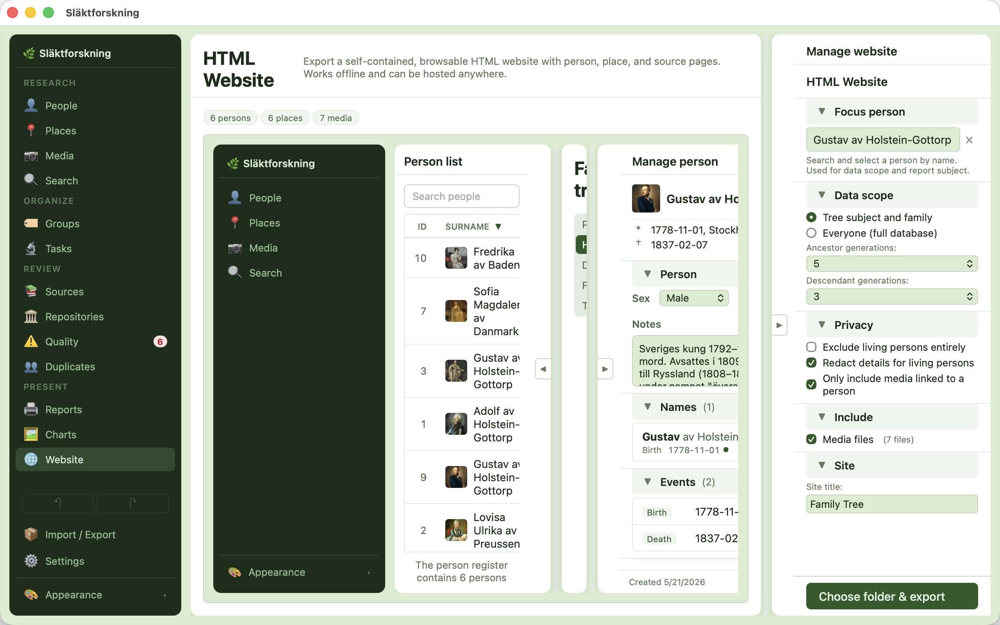

The **Website** view (Present → 🌐 Website) bakes your tree into a self-contained HTML site you can host anywhere. Configure:

- **Scope** — everyone, or every descendant/ancestor of a focal person, or every member of a group.
- **Living-person handling** — exclude living persons entirely, or redact their birth dates / names.
- **Media inclusion** — every linked media, or photos only, or none.
- **Theme** — Forest, Nordic, or Twilight (matches the app's themes).

Click **Build site**. The output goes to a folder you pick — a single self-contained HTML site with embedded JSON, JS, CSS, and image assets. Open `index.html` in any browser. The site has the same panels as the running app, but read-only and with no MCP / IPC dependency.

The site is GitHub Pages-ready, Netlify-ready, or just zip-it-and-email-it ready.

## Settings

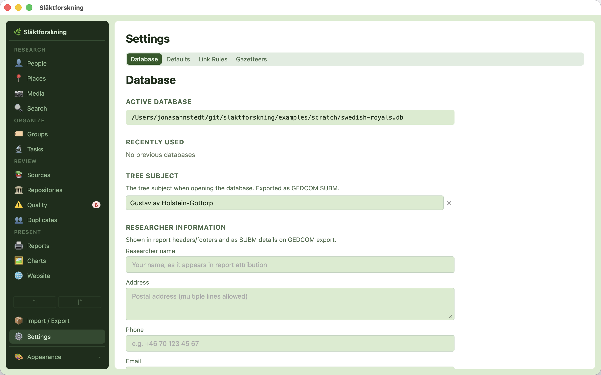

Settings (left sidebar → ⚙️ Settings) covers:

- **Appearance** — Light / Dark / High Contrast.
- **Theme** — Forest / Nordic / Twilight.
- **Text size** — accessibility-aware (rem-based; scales with OS font size too).
- **Language** — Swedish / English.
- **Database** — current DB path, switch, create new, recent DBs.
- **Gazetteers** — enable/disable bundled gazetteers per database; import custom JSONs.
- **Link rules** — auto-link URL patterns (Riksarkivet, FamilySearch, etc.).
- **Event defaults** — per-event-type default participants/roles.
- **Researcher info** — your name / address / phone / email — embedded in GEDCOM HEAD on export.
- **Reset onboarding** — re-show empty-state coachmarks.
- **About** — version, GitHub link, open-source licenses.

## Keyboard shortcuts

Cross-platform shortcuts:

| Key | Action |
|---|---|
| Cmd / Ctrl + N | Open a second window |
| Cmd / Ctrl + Z | Undo last mutation |
| Cmd / Ctrl + Shift + Z | Redo |
| Cmd / Ctrl + P | Print current report / chart |
| Cmd / Ctrl + F | Focus the search field |
| Esc | Close modal |
| Enter | Confirm modal (when focused) |

Screen-reader-mode hotkeys (when Settings → Read aloud → "Screen Reader" is selected):

| Key | Action |
|---|---|
| `?` | List available commands |
| `P`/`R`/`S`/`L`/`T`/`V`/`Q`/`D` | Navigate to Persons / Relationships / Sources / Places / Tasks / Visualization / Quality / Database |
| `F` or `/` | Focus search |
| `H` | Go home |
| `N` | Add new item |
| `E` | Edit focused item |
| `Delete` | Delete focused item |
| `1–6` | Jump to section (detail views) |
| Arrow keys | Navigate family tree (charts) |
| Ctrl+. | Stop speech-to-text |

## Accessibility

- **Screen reader mode** — third option alongside Off and Narrate. Narrates every focused element with rich context (e.g. "Gustav III, born 1746, son of Adolf Fredrik").
- **WCAG 2.1 AAA-compliant** high-contrast mode. Light and dark modes meet AA. Contrast ratios for every theme × appearance combination are regression-tested.
- **Three text sizes** scale all UI text via CSS rem units; respects OS font-size settings.
- **Keyboard navigation** throughout — every modal traps focus, Esc closes, tab order is meaningful.
- **TTS button** on every event / person / report — reads the entity aloud.

## Data ownership and backup

Your data is yours. Everything lives in a single SQLite file (`family.db` by default) plus a sibling media folder (`family-media/`). To back up: copy both. To migrate to another machine: copy both. To switch apps: export to GEDCOM 7.0 (lossless) or archive `.zip` (also lossless if you stay in Släktforskning).

The app never connects to a remote server for anything except the explicit user-initiated import/export to online genealogy services. Place resolution is fully offline (the gazetteers ship in the bundle). The MCP server speaks stdio; no network at all.

Recommended backup cadence:

- **Daily**: archive `.zip` export to your cloud sync (iCloud / Dropbox / OneDrive).
- **Per-major-edit-session**: GEDCOM 7.0 export to a versioned folder.

## Troubleshooting and FAQ

**The app shows "Gatekeeper / SmartScreen" warning on first launch.** Builds aren't code-signed yet. macOS: right-click the `.app` → Open the first time. Windows: click "More info" → "Run anyway". Linux: no warning, `chmod +x` and run.

**The map shows no pins.** Open any place and check the side panel's "Resolved via" row. If empty, no gazetteer matched — try a more specific place name (e.g. "Köpenhamn" → "København" in Danish, or add ", Danmark" qualifier). For Swedish parishes use the official SCB name.

**Imports report `unmappedData`.** That's expected and useful — Släktforskning tells you what it couldn't model from your source file. Common cases: LDS ordinances (intentionally not carried), private/sealed data (skipped), pre-1582 Julian/Gregorian-ambiguous dates (preserved as `date_original` but `date_type` stays `unknown`).

**Where do I report bugs?** Open an issue at <https://github.com/jonaseck2/slaktforskning/issues>. For security issues, use GitHub's [Private Vulnerability Reporting](https://docs.github.com/en/code-security/security-advisories/guidance-on-reporting-and-writing/privately-reporting-a-security-vulnerability) on the repo.

**Where can I see the bigger roadmap and release history?** [docs/PLAN.md](docs/PLAN.md) for active work; [docs/plans/archive/PLAN.md](docs/plans/archive/PLAN.md) for the per-milestone history; [CHANGELOG.md](CHANGELOG.md) for per-version release notes.
