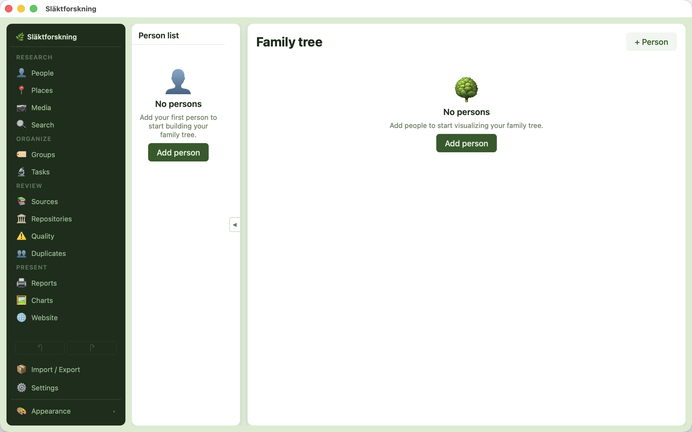
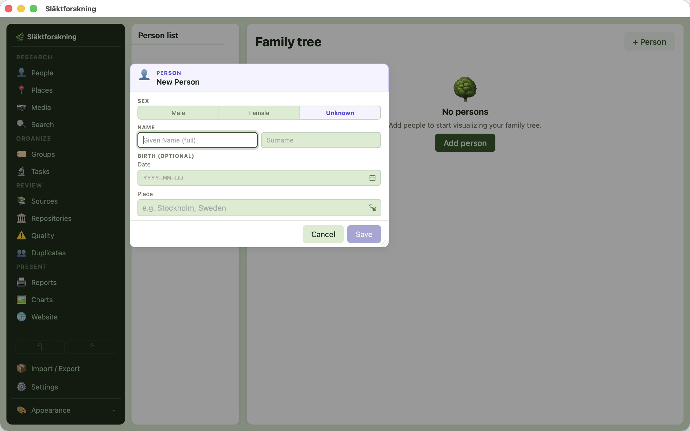
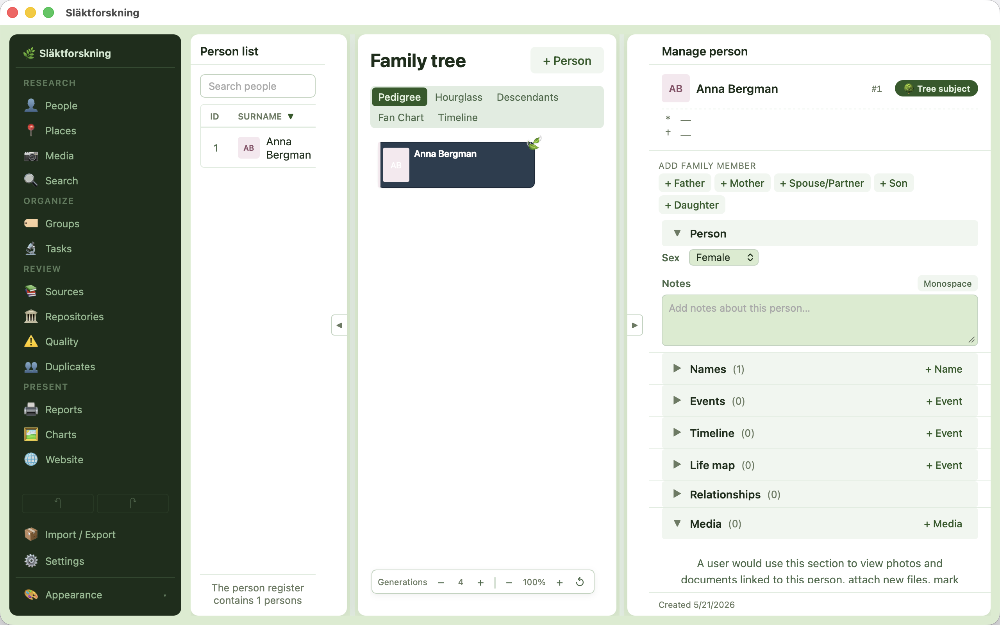
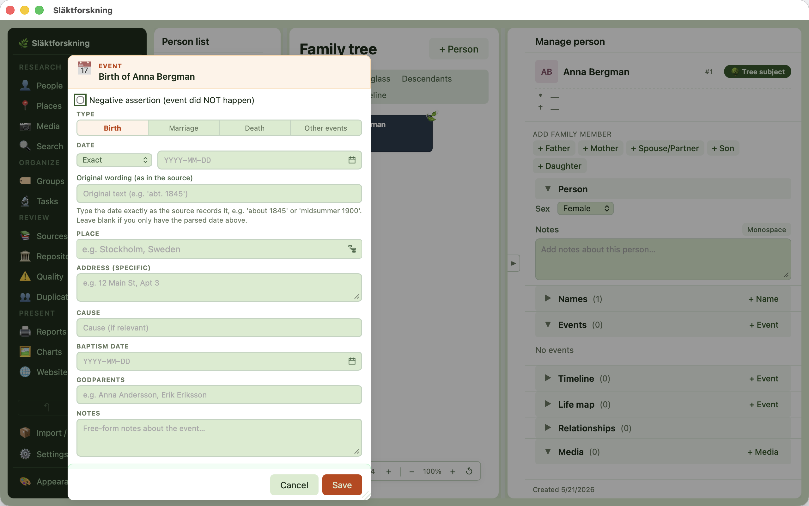
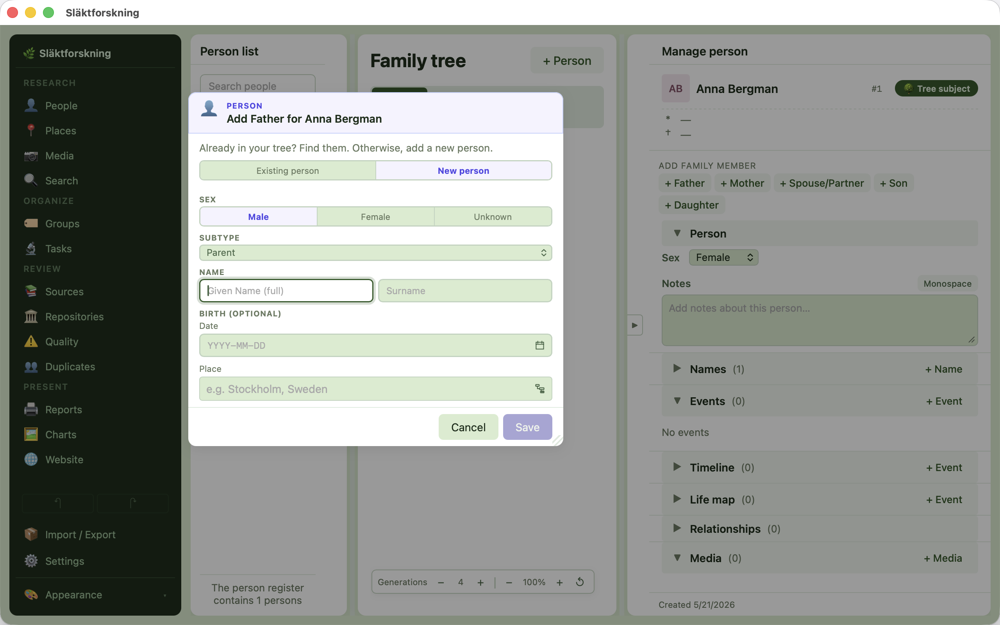
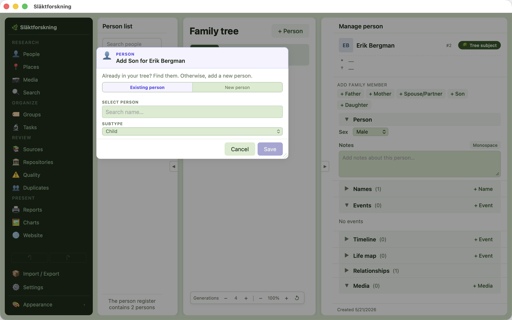
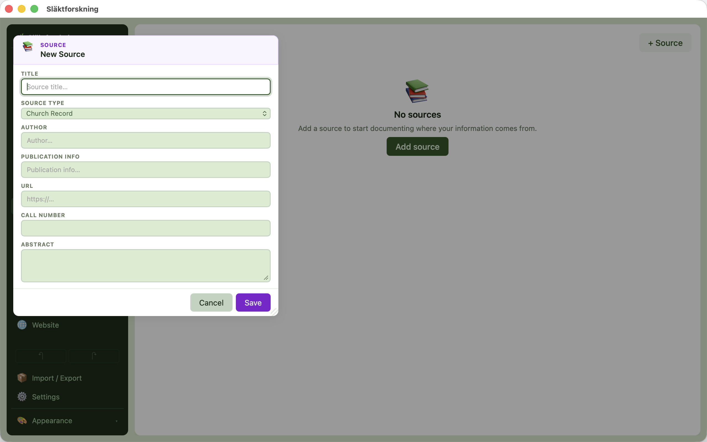
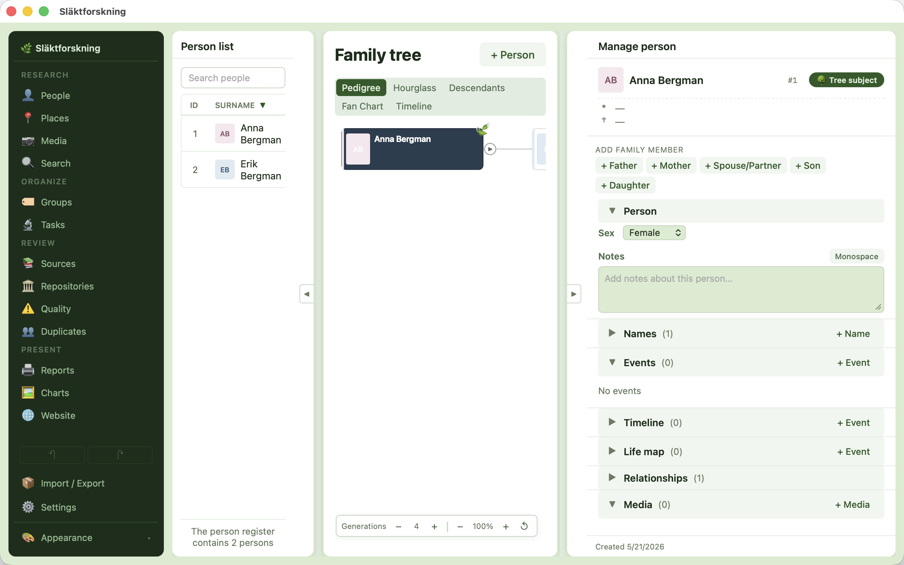

# Släktforskning

*Swedish for "genealogy".*

A local-first, cross-platform desktop app for genealogy research. Your family tree, your data, your machine.

[](https://github.com/jonaseck2/slaktforskning/actions/workflows/ci.yml)
[](https://github.com/jonaseck2/slaktforskning/actions/workflows/release.yml)
[](LICENSE)


---

## What is this?

Släktforskning is a desktop genealogy application built with Tauri 2, Vue 3, and SQLite. All data stays on your machine — no cloud account, no subscription, no upload. A built-in MCP server lets AI agents like Claude read and write your genealogy data through natural conversation. The interface is available in Swedish and English.

## Features

- **Local SQLite database** — no cloud, no account, full data ownership
- **Import from** GEDCOM 5.5.1 / 7.0, Genney, Holger, RootsMagic, and Gramps; **export to** GEDCOM 5.5.1 / 7.0
- **Family tree charts** — pedigree, hourglass, descendant, fan, timeline
- **Keepsake reports** — A Life, A Marriage, Place Chronicle, Your Ancestors, Life on One Page, Family in Year X, Photo Album
- **Places with interactive map** — pin life events, browse place history, view boundary polygons
- **Place resolution** with 29 bundled gazetteers covering Scandinavia, North America, and the world
- **Source citations** with confidence levels and verbatim transcriptions
- **Source link rules** — auto-link references to ArkivDigital, Riksarkivet, FamilySearch, Ancestry, MyHeritage, and more
- **Repositories** — track archives and link them to sources
- **Media library** — attach photos and documents to persons, events, places; tag faces; auto-cropped profile pictures
- **Research tasks** — prioritized to-do list with status tracking, per-person or global
- **Groups** — organize persons into custom collections (e.g. emigrants, military service)
- **Quality checks** — automated data validation with per-row fix actions
- **Duplicate detection & merge** — find and combine duplicate persons
- **Multi-database** — switch between separate family trees without restarting
- **Built-in MCP server** — 80 tools for AI-powered genealogy research
- **Multi-window** — open multiple windows for different parts of your tree
- **Themes & appearance** — three color themes (Forest, Nordic, Twilight) × three modes (Light, Dark, High Contrast)
- **Accessibility** — screen reader mode, WCAG AAA high-contrast, keyboard navigation, TTS
- **Swedish and English** interface

## Installation

Download the latest installer from the [Releases](https://github.com/jonaseck2/slaktforskning/releases) page:

| Platform | Format |
|----------|--------|
| macOS | `.dmg` (drag the bundled `.app` to /Applications) |
| Windows | `.exe` (NSIS installer) |
| Linux | `.AppImage` (single-file portable) |

> **Note:** Builds are currently unsigned. macOS will show a Gatekeeper warning on first launch — right-click the app and choose Open to bypass it. Windows may show a SmartScreen warning.

## Your first family tree in 10 minutes

A guided walk-through that takes a brand-new install from empty to a small, sourced family. The full reference is in [MANUAL.md](MANUAL.md); this is the path-of-least-resistance for someone who has just downloaded the app.

1. **Install and open the app.** macOS: drag the `.app` to /Applications and right-click → Open the first time (unsigned). Windows: run the NSIS installer. Linux: `chmod +x` the `.AppImage` and double-click. The app opens to an empty Persons view.

   

2. **Add yourself first.** Click **+ Person** in the top-right. Fill in your given name and surname. Pick your sex. Press **Save**. The new row appears in the Persons list on the left.

   

3. **Open your side panel.** Click your row. The right-hand panel shows your details. This is where every part of your record — events, names, sources, media, groups — lives.

   

4. **Add a birth event.** In the side panel, scroll to **Events** and press **+ Event**. Pick **birth**, type your birth date, and add your birthplace. The place auto-resolves against the bundled gazetteers — start typing "Stockholm" and pick the match. Press **Save**.

   

5. **Add a parent.** In **Add family member** at the top of the panel, click **+ Father** (or Mother). Fill the modal exactly like step 2. The parent appears in the Persons list AND as a related person in your side panel.

   

6. **Add a sibling or child.** From your father's side panel (click his row), use **+ Son** or **+ Daughter** to add yourself's sibling, or use **+ Spouse/Partner** on yourself first and then **+ Son/+ Daughter** to add a child. Every new person gets a row in the list.

   

7. **Attach a source.** Click **+ Source** in the side panel's **Sources** section. Type the source title (e.g. your birth certificate, a church record, an Ancestry tree URL). Save. Then click **Cite** on any event to link the source to that event with a page reference and confidence level.

   

8. **Look at your tree.** Click the **Family tree** tab in the center. Pick **Pedigree** (ancestors-only) or **Hourglass** (ancestors + descendants). Your tree renders with portraits if you've attached any media. Click any person in the tree to refocus.

   

Next steps when you're ready:

- **Import an existing tree** via Settings → Import — GEDCOM 5.5.1 / 7.0, Genney, Holger, RootsMagic, or Gramps. Drop in your file; the importer reports what was modelled and what couldn't be (e.g. ASSO-without-event in 5.5.1).
- **Open a second window** with Cmd+N (macOS) / Ctrl+N (Windows / Linux) — useful for side-by-side person research.
- **Add face tags to media** — open any photo in the media viewer (double-click), press **+ Draw**, drag a rectangle around a face, assign a person. That cropped face becomes the person's profile picture everywhere in the app.
- **Export to a static keepsake site** via Settings → Website — bake your tree into a self-contained HTML site you can host anywhere.

See [MANUAL.md](MANUAL.md) for the full reference covering every panel, importer, report, and feature.

## MCP Server

Släktforskning includes a built-in MCP server that lets AI agents interact with your genealogy data. Use Claude Desktop or Claude Code to research, write narratives, audit sources, and manage your tree through natural conversation.

### Claude Desktop setup

Add this to your `claude_desktop_config.json`:

```json
{
  "mcpServers": {
    "slaktforskning": {
      "command": "npx",
      "args": ["tsx", "src/mcp/server.ts"],
      "cwd": "/path/to/slaktforskning",
      "env": { "SLAKTFORSKNING_DB": "/path/to/your/database.db" }
    }
  }
}
```

### Claude Code setup

The repo includes a `.mcp.json` that Claude Code picks up automatically when you open the project.

The server exposes 80 tools covering persons, families, events, sources, places, research tasks, media, repositories, groups, duplicates, and data management. See [docs/MCP.md](docs/MCP.md) for the full tool reference.

## Development

```bash
git clone https://github.com/jonaseck2/slaktforskning.git
cd slaktforskning
npm install
npm start       # Launch in dev mode
npm test        # Unit tests
npm run lint    # ESLint
```

See [DEVELOPING.md](DEVELOPING.md) for the full developer guide — build commands, dev container, debugging, gazetteer scripts, and architecture overview.

## Contributing

See [CONTRIBUTING.md](CONTRIBUTING.md) for coding conventions, commit format, and PR guidelines.

All contributors are expected to follow the [Code of Conduct](CODE_OF_CONDUCT.md).

## Changelog

See [CHANGELOG.md](CHANGELOG.md) for release history.

## License

MIT — see [LICENSE](LICENSE).
