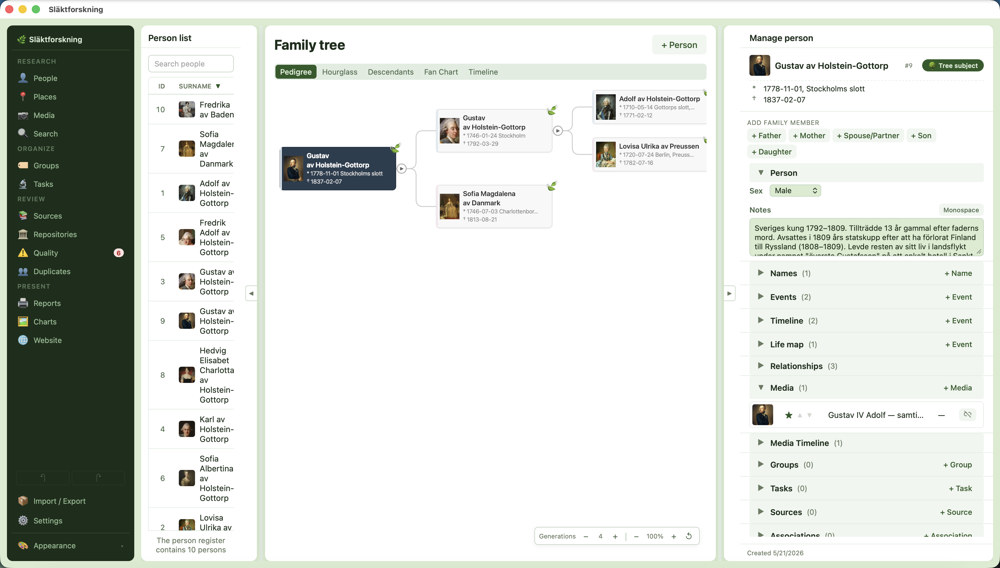

# Släktforskning

A local-first, cross-platform desktop app for genealogy research. Your family tree, your data, your machine.

[](https://github.com/jonaseck2/slaktforskning/actions/workflows/ci.yml)
[](https://github.com/jonaseck2/slaktforskning/actions/workflows/release.yml)
[](LICENSE)

<!-- TODO: replace with a real screenshot -->
<!--  -->

---

## What is this?

Släktforskning is a desktop genealogy application built with Electron, Vue 3, and SQLite. All data stays on your machine — no cloud account, no subscription, no upload. A built-in MCP server lets AI agents like Claude read and write your genealogy data through natural conversation. The interface is available in Swedish and English.

## Features

- **Local SQLite database** — no cloud, no account, full data ownership
- **Import from** GEDCOM 5.5.1 / 7.0, Genney, and Holger; **export to** GEDCOM 5.5.1 / 7.0
- **Family tree charts** — pedigree, hourglass, descendant, fan, timeline
- **Keepsake reports** — A Life, A Marriage, Place Chronicle, Your Ancestors, Life on One Page, Family in Year X, Photo Album
- **Places with interactive map** — pin life events, browse place history, view boundary polygons
- **Place resolution** with 27 bundled gazetteers covering Scandinavia, North America, and the world
- **Source citations** with confidence levels and verbatim transcriptions
- **Source link rules** — auto-link references to ArkivDigital, Riksarkivet, FamilySearch, Ancestry, MyHeritage, and more
- **Repositories** — track archives and link them to sources
- **Media library** — attach photos and documents to persons, events, places; tag faces; auto-cropped profile pictures
- **Research tasks** — prioritized to-do list with status tracking, per-person or global
- **Groups** — organize persons into custom collections (e.g. emigrants, military service)
- **Quality checks** — automated data validation with per-row fix actions
- **Duplicate detection & merge** — find and combine duplicate persons
- **Multi-database** — switch between separate family trees without restarting
- **Built-in MCP server** — 34 tools for AI-powered genealogy research
- **Multi-window** — open multiple windows for different parts of your tree
- **Themes & appearance** — three color themes (Forest, Nordic, Twilight) × three modes (Light, Dark, High Contrast)
- **Accessibility** — screen reader mode, WCAG AAA high-contrast, keyboard navigation, TTS
- **Swedish and English** interface

## Installation

Download the latest installer from the [Releases](https://github.com/jonaseck2/slaktforskning/releases) page:

| Platform | Format |
|----------|--------|
| macOS | `.dmg` |
| Windows | `.exe` (Squirrel installer) |
| Linux | `.deb` / `.rpm` |

> **Note:** Builds are currently unsigned. macOS will show a Gatekeeper warning on first launch — right-click the app and choose Open to bypass it. Windows may show a SmartScreen warning.

## Getting Started

The app opens with a sidebar showing **Persons**, **Relationships**, **Sources**, and more.

- Click **Add Person** to create your first person
- Click any row to open the detail view — add names, events, and citations there
- Use **Cmd+N** (macOS) or **Ctrl+N** (Windows/Linux) to open a second window for side-by-side research
- Import an existing tree via **Settings > Import** (GEDCOM, Genney, or Holger format)

## MCP Server

Släktforskning includes a built-in MCP server that lets AI agents interact with your genealogy data. Use Claude Desktop or Claude Code to research, write narratives, audit sources, and manage your tree through natural conversation.

### Claude Desktop setup

Add this to your `claude_desktop_config.json`:

```json
{
  "mcpServers": {
    "slaktforskning": {
      "command": "npx",
      "args": ["tsx", "src/mcp/server.ts"],
      "cwd": "/path/to/slaktforskning",
      "env": { "SLAKTFORSKNING_DB": "/path/to/your/database.db" }
    }
  }
}
```

### Claude Code setup

The repo includes a `.mcp.json` that Claude Code picks up automatically when you open the project.

The server exposes 34 tools covering persons, families, events, sources, places, research tasks, media, and data management. See [docs/MCP.md](docs/MCP.md) for the full tool reference.

## Development

```bash
git clone https://github.com/jonaseck2/slaktforskning.git
cd slaktforskning
npm install
npm start       # Launch in dev mode
npm test        # Unit tests
npm run lint    # ESLint
```

See [DEVELOPING.md](DEVELOPING.md) for the full developer guide — build commands, dev container, debugging, gazetteer scripts, and architecture overview.

## Contributing

See [CONTRIBUTING.md](CONTRIBUTING.md) for coding conventions, commit format, and PR guidelines.

All contributors are expected to follow the [Code of Conduct](CODE_OF_CONDUCT.md).

## Changelog

See [CHANGELOG.md](CHANGELOG.md) for release history.

## License

MIT — see [LICENSE](LICENSE).
Demo run v2: 2026-04-30
